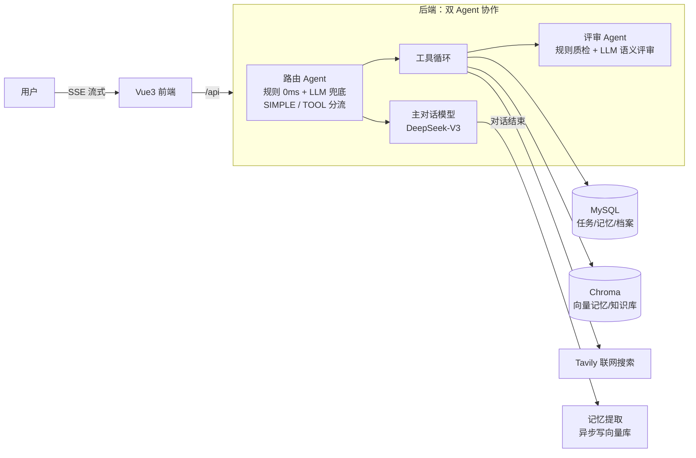

# Student Agent — AI 学习规划智能体

基于 Spring Boot 3 + LangChain4j 构建的学习助手：支持多轮流式对话、向量长期记忆、日历任务管理、学习计划生成、艾宾浩斯复习排期、学习周报与用户画像。

> 核心亮点：**双 Agent 协作**（路由 Agent + 评审 Agent）+ **真流式优先/工具兜底双通道** + **向量长期记忆**

## 架构



## 核心设计

### 1. 双 Agent 协作
- **路由 Agent**（`ChatRouter`）：入口分流。规则路由（关键词匹配，0ms）优先，判不准时 LLM 二级路由（1.5s 超时兜底），闲聊走纯流式、任务走工具循环。失败一律降级 TOOL（= 改造前行为，安全超集）
- **评审 Agent**（`ToolResultReviewAgent`）：工具结果质检。写操作走确定性规则（空结果防幻觉、userId 比对防跨用户泄露，0 开销），只读工具（知识库/联网搜索）额外过 LLM 语义相关性评审；评审失败一律放行原始结果，永不比现状差

### 2. 真流式优先 + 工具兜底
无工具请求直接真流式输出（首 token 毫秒级）；流式中检测到工具调用请求时自动降级为阻塞工具循环，完成后分块模拟流式输出，前端零改动。

### 3. 向量长期记忆
对话结束异步提取学习特征 → 嵌入写入 Chroma（Qwen3-Embedding-0.6B，1024 维）→ 后续对话按 userId 过滤召回（minScore=0.7）注入 system prompt。含极性冲突检测、新旧覆盖、去重、时效标注。

### 4. 工具系统
LangChain4j `@Tool` 注解 + 手动工具循环：日历增删查、学习计划生成、艾宾浩斯复习排期、知识库检索、联网搜索。用户身份/会话通过 ThreadLocal 上下文传递。

## 技术栈

| 层 | 技术 |
|---|---|
| 后端 | Spring Boot 3.5.13、Java 17、MyBatis、LangChain4j 1.17.2 |
| 模型 | DeepSeek-V3（聊天，SiliconFlow）、Qwen3-Embedding-0.6B（向量） |
| 存储 | MySQL 8、Redis 7（对话历史缓存）、Chroma（向量库） |
| 前端 | Vue 3 + Vite + Element Plus、SSE 流式渲染 |
| 测试 | JUnit 5 + Mockito 单测、PowerShell 21 条端到端回归 |

## 快速开始

### 环境要求

- JDK 17、Maven 3.8+（或直接用自带的 `mvnw`）
- Node.js 18+
- MySQL 8、Docker（跑 Chroma 和 Redis）
- [SiliconFlow](https://siliconflow.cn) API Key（模型）、[Tavily](https://tavily.com) API Key（联网搜索，可选）

### 1. 初始化数据库

创建 `student_agent` 库并执行建表脚本：

```sql
CREATE DATABASE student_agent DEFAULT CHARACTER SET utf8mb4;
```

```bash
mysql -uroot -p student_agent < backend/src/main/resources/sql/init.sql
```

### 2. 启动中间件

```bash
cd backend
docker-compose up -d   # 启动 Chroma(8000) 和 Redis(6379)
```

### 3. 配置 API Key

二选一：

**方式 A：环境变量（推荐）**

```bash
# Windows PowerShell
$env:SILICONFLOW_API_KEY = "sk-xxxx"
$env:TAVILY_API_KEY = "tvly-xxxx"
```

**方式 B：本地配置文件**

```bash
# 复制模板并填入 Key（该文件已被 .gitignore 忽略）
cp backend/src/main/resources/application-local.example.yml backend/src/main/resources/application-local.yml
```

### 4. 启动后端（端口 8080）

```bash
cd backend
mvn spring-boot:run        # 或 Windows 下 ./mvnw.cmd spring-boot:run
```

首次启动会自动完成：知识库向量化入库、创建测试账号：

| 账号 | 密码 | 说明 |
|---|---|---|
| kaoyan_zhang | 123456 | 考研用户（含学习档案、日历演示数据） |
| qimo_lihua / freshman_wang | 123456 | 期末/大一场景用户 |

### 5. 启动前端（端口 5173）

```bash
cd frontend
npm install
npm run dev
```

浏览器打开 http://localhost:5173，用测试账号登录即可体验。

## 运行测试

```bash
# 单元测试（指定类，无需中间件）
cd backend
mvn test "-Dtest=RuleBasedRouterTest,ToolResultReviewAgentTest,MemoryLogicTest"

# 端到端回归（21 条用例，需后端已启动）
powershell -NoProfile -ExecutionPolicy Bypass -File backend/test-suite.ps1
```

## 项目结构

```
├── backend/
│   ├── src/main/java/com/studentagent/studentagent/
│   │   ├── service/
│   │   │   ├── ChatService.java        # 对话主链路：路由分流/流式/工具循环/记忆注入
│   │   │   ├── router/                 # 路由 Agent（规则 + LLM）
│   │   │   ├── review/                 # 评审 Agent（规则 + LLM）
│   │   │   ├── CalendarService.java    # 日历/计划/复习排期
│   │   │   ├── MemoryExtractService.java # 记忆提取与冲突处理
│   │   │   └── ReportService.java      # 学习周报
│   │   ├── tool/                       # LangChain4j @Tool 工具集
│   │   └── config/                     # 模型/向量库配置、启动初始化
│   ├── src/main/resources/sql/init.sql # 建表脚本
│   └── test-suite.ps1                  # 21 条端到端回归测试
└── frontend/                           # Vue3 前端（SSE 流式渲染）
```

## 可选配置

`backend/src/main/resources/application.yml` 中两组 Agent 开关（默认开启，均可一键回退旧行为）：

```yaml
agent:
  router:
    enabled: true          # 路由 Agent 总开关，false 时全量走工具路径
  review:
    enabled: true          # 评审 Agent 总开关，false 时结果全部直通
```
